# _Pisca Led_


---

## Sumário

- [Histórico de Versão](#histórico-de-versão)
- [Resumo](#resumo)
- [Links para estudos](#links-para-estudos)
- [Fluxograma](#fluxograma)
- [Pinos do projeto eletrônico](#pinos-do-projeto-eletrônico)
- [Configuração do simulador PICSimLab](#configuração-do-simulador-picsimlab)
- [Configuração do Firmware](#configuração-do-firmware)
- [Informações](#informações)

## Histórico de Versão

| Versão | Data       | Autor       | Descrição         |
|--------|------------|-------------|-------------------|
| 1.0.0  | 05/03/2024 | Adenilton R | Início do Projeto |

---

## Resumo

Este documento tem como objetivo demonstrar como configurar o simulador PICSimLab para executar um firmware que controla o estado de um LED em um microcontrolador, fazendo-o piscar a cada 500ms.

## Links para estudos

[Informações da placa;](https://lcgamboa.github.io/picsimlab_docs/0.9.1/PICGenios.html)

[Esquemático da placa;](https://lcgamboa.github.io/picsimlab_docs/0.9.1/pdf/boards/PICGenios.pdf)

[Site da Microchip;](https://www.microchip.com/en-us/product/pic18f47k40)

[Datasheet do microcontrolador;](https://ww1.microchip.com/downloads/aemDocuments/documents/OTH/ProductDocuments/DataSheets/PIC18LF27_47K40-Data-Sheet-40001844E.pdf)

## Fluxograma

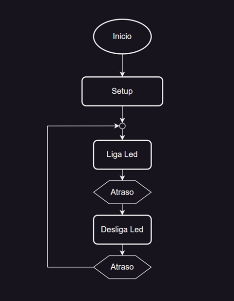

## Pinos do projeto eletrônico

| Nome | Pino |
|------|------|
| Led  | RB0  |

[Esquemático da placa;](https://lcgamboa.github.io/picsimlab_docs/0.9.1/pdf/boards/PICGenios.pdf)

## Configuração do simulador PICSimLab

💡 [Para baixar e instalar PICSimLab;](https://github.com/AdeniltonR/Exemplos-de-firmware-para-PIC/blob/main/README.md)

Inicie o software `PICSimLab` e, em seguida, clique em `Board` e selecione `PICGenios`:

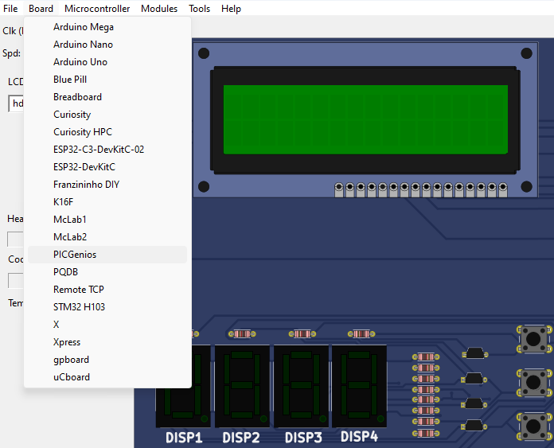

Em seguida, vá até a opção `Microcontroller` e selecione o `PIC18F47K40` na lista disponível:

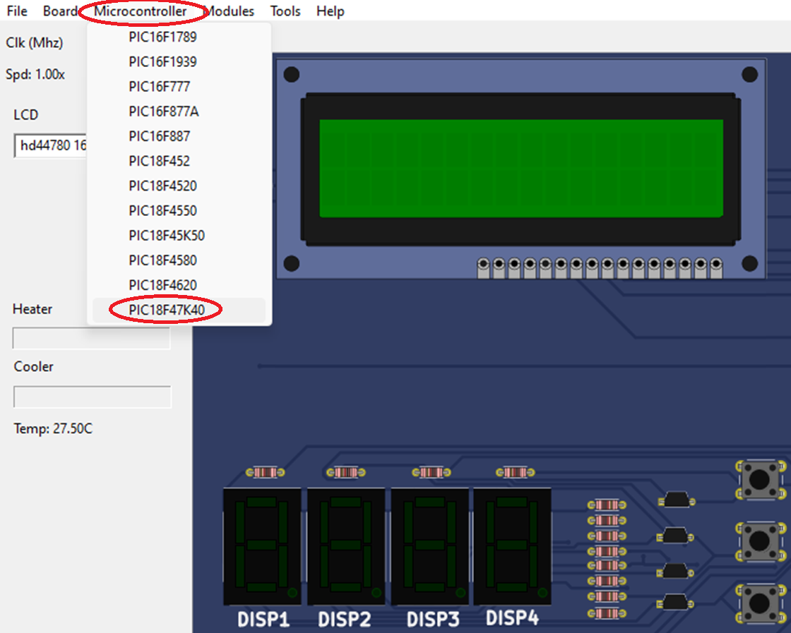

Em seguida, vá até opcão `Clk(Mhz)` e selecione `8 Mhz`:

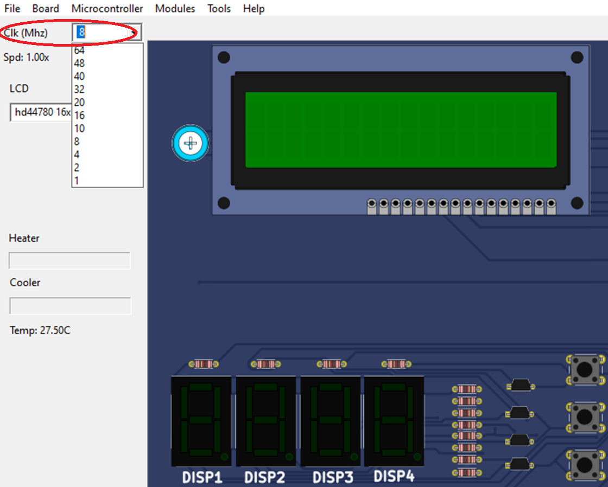

Em seguida, vá até opcão `File` e selecione `Load Hex`:

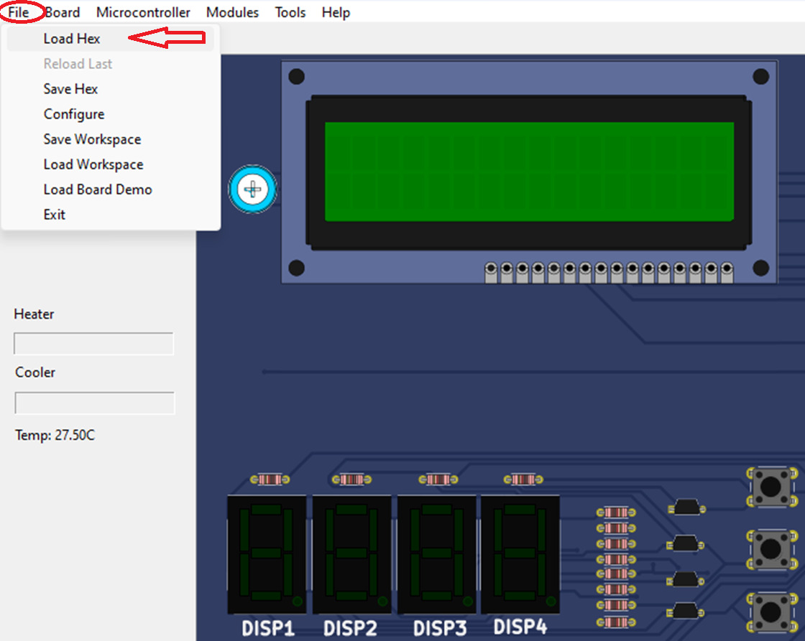

Depois disso, navegue até o local onde seu projeto está salvo e selecione a pasta `1-Pisca-led.x/dist/default/production` para abri-la:

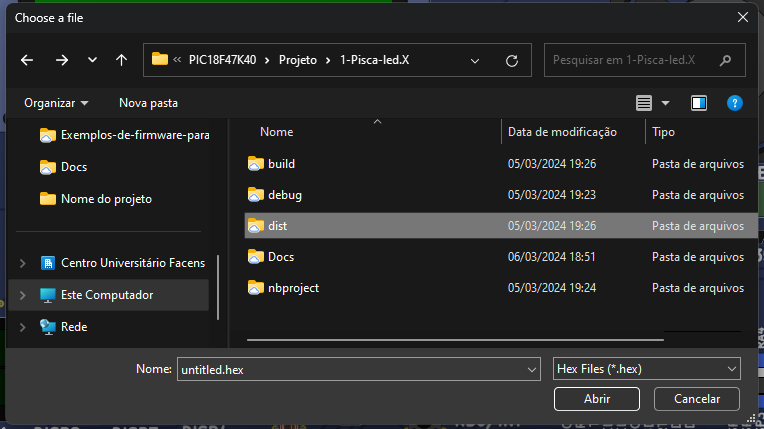

E selecione o arquivo `.hex`, que provavelmente estará nomeado como `1-Pisca-led.production.hex`, e clique para abrir:

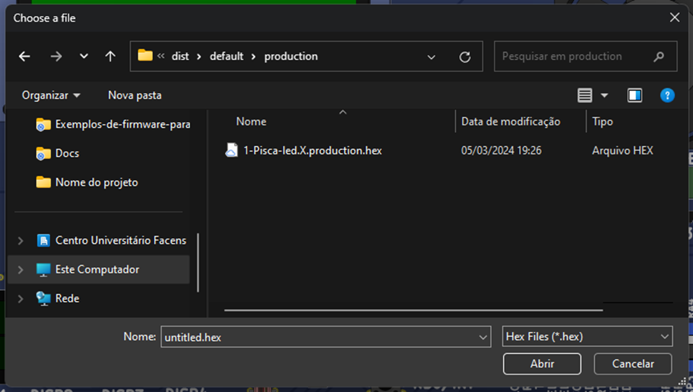

No simulador, configure os jumps com as seguintes configurações: onde estiver `RTC == RB0`, selecione a chave para `baixo` conforme mostrado na imagem abaixo:

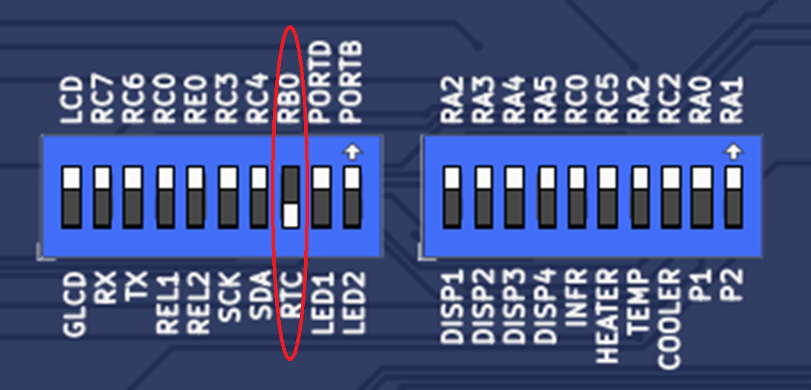

Se tudo estiver configurado adequadamente, o `LED` conectado ao pino `B0` deverá piscar:

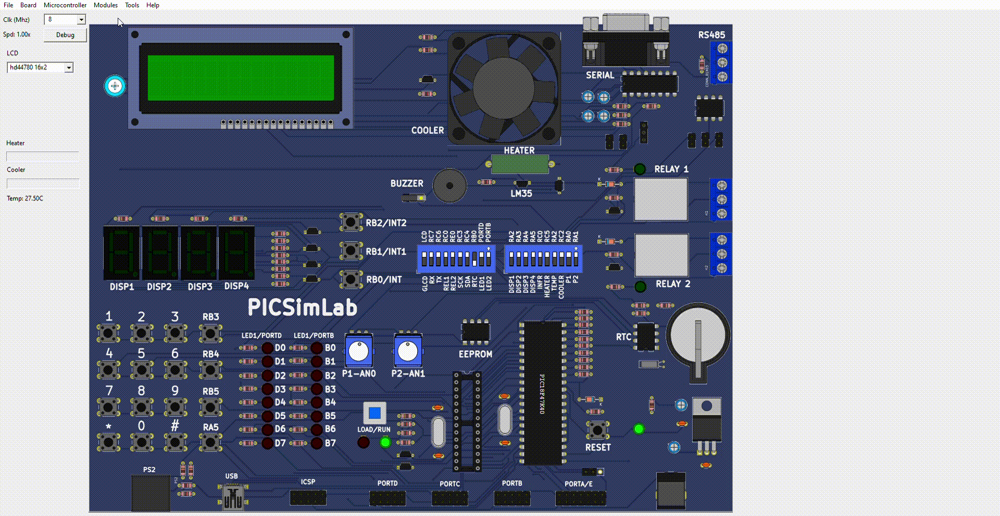

## Configuração do Firmware

💡 [Para baixar e instalar MPLAB e XC8;](https://github.com/AdeniltonR/Exemplos-de-firmware-para-PIC/blob/main/README.md)

💡 [Para configurar o MCU;](https://github.com/AdeniltonR/Exemplos-de-firmware-para-PIC/tree/main/Familia%20PIC/PIC18F47K40)

Depois de configurar os Fuses do seu PIC e adicionar no seu arquivo `main.c`, vamos começar a trabalhar no código para fazer o LED piscar. Com o seu projeto aberto, vamos iniciar configurando os `includes` conforme mostrado na imagem abaixo:

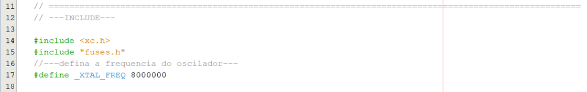

O `#include <xc.h>` é uma biblioteca específica para o microcontrolador que estamos utilizando, o PIC18F47K40. O `#include "fuses.h"` é uma configuração que fizemos no passo anterior. Agora, uma nova adição é configurar a frequência do cristal externo do MCU, que estamos definindo como 8MHz usando `#define XTAL_FREQ 8000000`:

```c
// ========================================================================================================
// ---INCLUDE---

#include <xc.h>
#include "fuses.h"
//---defina a frequencia do oscilador---
#define _XTAL_FREQ 8000000
```

Agora, vamos configurar o mapeamento de hardware, que consiste em dar um nome ao pino que estamos configurando, que é o `RB0`. Estamos renomeando-o como `PIN_led` usando `#define PIN_led RB0`:

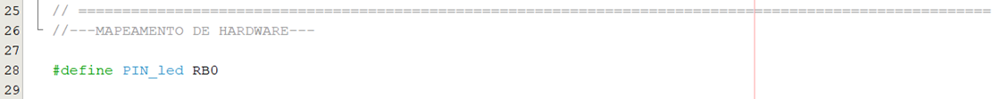

```c
// ========================================================================================================
//---MAPEAMENTO DE HARDWARE---

#define PIN_led RB0
```

Agora, dentro da função principal `void main(void)`, vamos configurar o pino RB0 como saída usando as diretivas de configuração de porta, `TRISBbits.TRISB0 = 0;`, e também vamos inicializar o loop com o pino em sinal baixo, `PIN_led = 0;`:

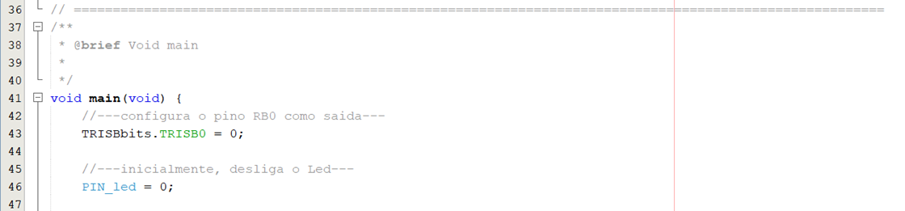

```c
void main(void) {
    //---configura o pino RB0 como saida--- 
    TRISBbits.TRISB0 = 0;
    
    //---inicialmente, desliga o Led---
    PIN_led = 0;
```

Por fim, no nosso loop (while), vamos ligar e desligar o pino por 500 milissegundos: nível alto no pino `PIN_led = 1;` e nível baixo no pino `PIN_led = 0;`. Além disso, vamos atrasar o código em 500 ms usando `__delay_ms(500);`:


```c
while (1) {
        PIN_led = 1;
        __delay_ms(500); 
        PIN_led = 0; 
        __delay_ms(500);
  }
```

Depois de concluir toda a programação, basta posicionar o cursor sobre o ícone do projeto `1-Pisca-led`, clicar com o botão direito do mouse e selecionar `Build`:

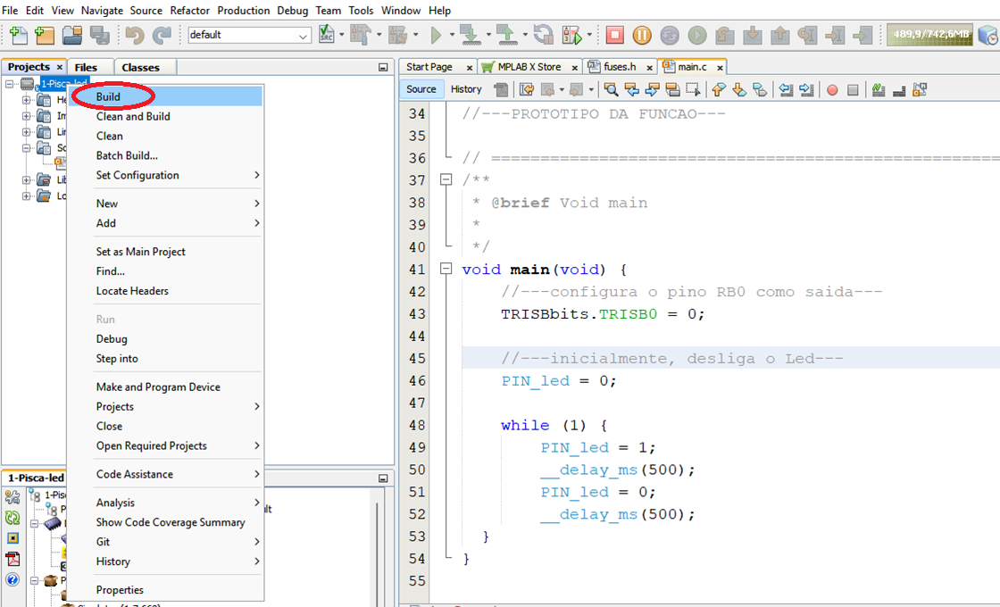

Se o código foi digitado corretamente, você verá uma mensagem de sucesso:

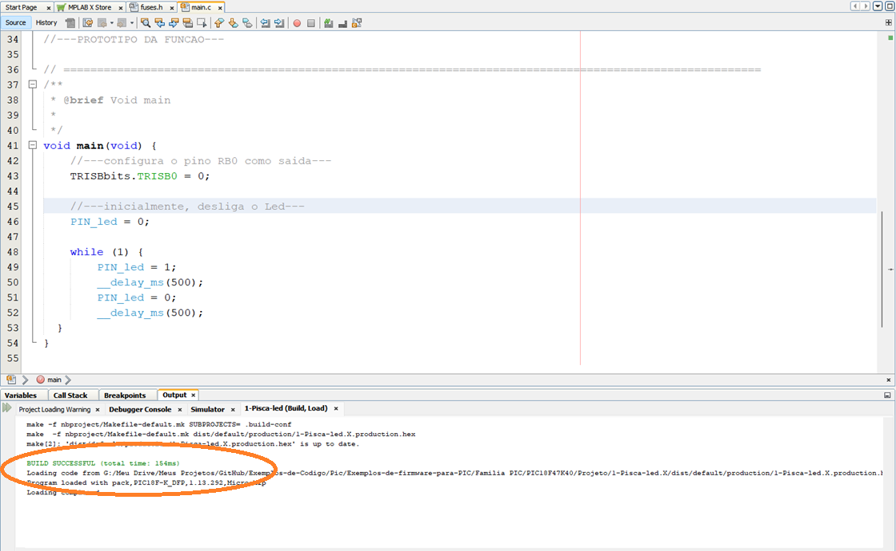

Abaixo, você encontrará todo o firmware para usar e modificar, utilizando outros pinos para testes. Com isso, você pode usar o arquivo hex para realizar simulações, conforme mostrado anteriormente no PICSimLab:

```c
/*
 * NOME: Adenilton Ribeiro
 * DATA: 04/02/2024
 * PROJETO: Pisca Led
 * VERSAO: 01
 * DESCRICAO: - feat: Fazer MCU piscar um led.
 *            - docs: MPLAB X IDE v6.20 - Compilador XC8 2.46 - PICSimLab Simulador 0.9.1
 * LINKS:
*/

// ========================================================================================================
// ---INCLUDE---

#include <xc.h>
#include "fuses.h"
//---defina a frequencia do oscilador---
#define _XTAL_FREQ 8000000  

// ========================================================================================================
//---BIBLIOTECAS AUXILIARES---

// ========================================================================================================
//---MAPEAMENTO DE ESTADO---

// ========================================================================================================
//---MAPEAMENTO DE HARDWARE---

#define PIN_led RB0

// ========================================================================================================
//---VARIAVEIS GLOBAIS---

// ========================================================================================================
//---PROTOTIPO DA FUNCAO---

// ========================================================================================================
/**
 * @brief Void main
 * 
 */ 
void main(void) {
    //---configura o pino RB0 como saida--- 
    TRISBbits.TRISB0 = 0;
    
    //---inicialmente, desliga o Led---
    PIN_led = 0;
    
    while (1) {
        PIN_led = 1;
        __delay_ms(500); 
        PIN_led = 0; 
        __delay_ms(500);
  }
}

```
## Informações

| Info        | Modelo            |
|-------------|-------------------|
| uC          | PIC18F47K40       |
| Placa       | PICGenios         |
| Arquitetura | RISC              |
| IDE         | MPLAB X IDE v6.20 |
| Compilador  | XC8 v2.46         |