# _Configuração MCU_


---

## Sumário

- [Resumo](#resumo)
- [Requisitos](#requisitos)
- [Links para estudos](#links-para-estudos)
- [Projetos](#projetos)
- [Informações Adicionais](#informações-adicionais)
    - [Configuração do Microcontrolador PIC18F47K40](#configuração-do-microcontrolador-pic18f47k40)

## Resumo

Este documento tem como objetivo fornecer orientações para a configuração do ambiente de trabalho para o microcontrolador PIC18F47K40, incluindo as configurações de seus `fuses`.

## Requisitos

Configuração do microcontrolador:

⚙️ PIC18F47K40

## Links para estudos

[Informações da placa;](https://lcgamboa.github.io/picsimlab_docs/0.9.1/PICGenios.html)

[Esquemático da placa;](https://lcgamboa.github.io/picsimlab_docs/0.9.1/pdf/boards/PICGenios.pdf)

[Site da Microchip;](https://www.microchip.com/en-us/product/pic18f47k40)

[Datasheet do microcontrolador;](https://ww1.microchip.com/downloads/aemDocuments/documents/OTH/ProductDocuments/DataSheets/PIC18LF27_47K40-Data-Sheet-40001844E.pdf)

## Projetos

[1 - Pisca Led;](https://github.com/AdeniltonR/Exemplos-de-firmware-para-PIC/tree/main/Familia%20PIC/PIC18F47K40/Projeto/1-Pisca-led.X)

[2 - Botão;]()

3 - Leitura Analógica;

## Informações Adicionais

Este documento apresentará os passos detalhados para a configuração do ambiente, incluindo os softwares necessários.

### Configuração do Microcontrolador PIC18F47K40

Inicie o software `MPLAB X IDE` e, em seguida, clique em `File` e selecione `New Project`:

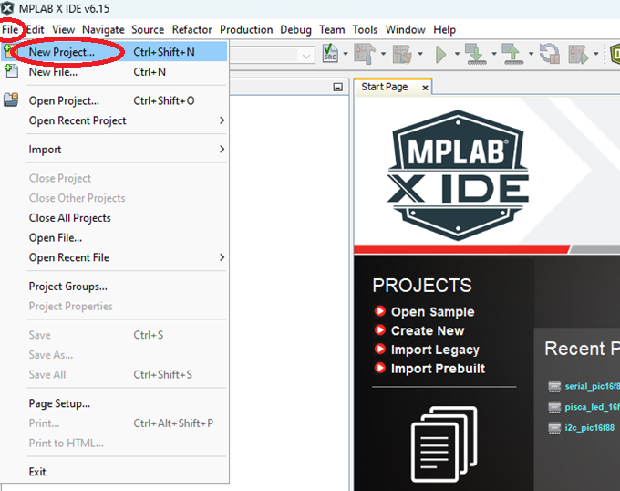

Em seguida, clique em `Next>`:

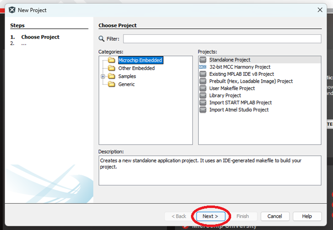

Em seguida, selecione o microcontrolador `PIC18F47K40` em `Device:`, escolha a ferramenta `Simulator` em `Tool:` e clique em `Next>`:

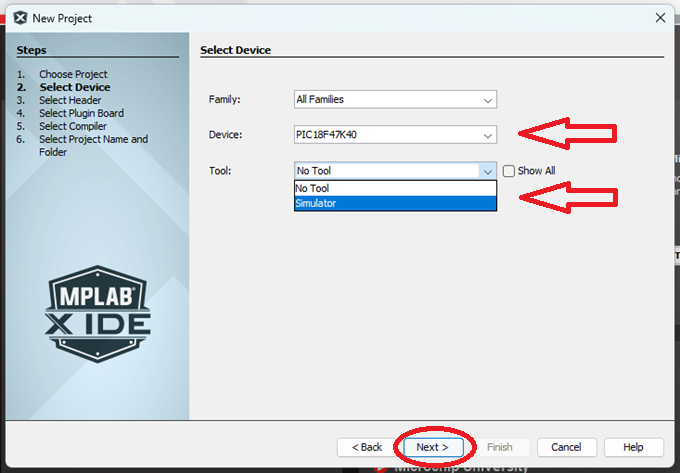

Em seguida, selecione o `Compiler Toolchains` e clique em `Next>`:

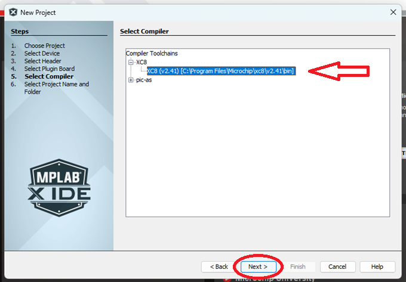

Em seguida, insira o nome do projeto em `Project Name:`, escolha a pasta de sua preferência em `Project Location:`, e clique em `Finish`:

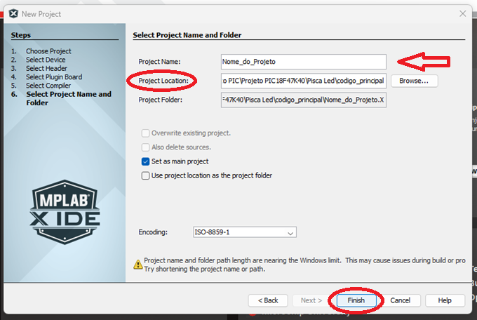

Após a criação do projeto, clique com o botão direito em `Source Files`, navegue até `New` e selecione `Main.c`:

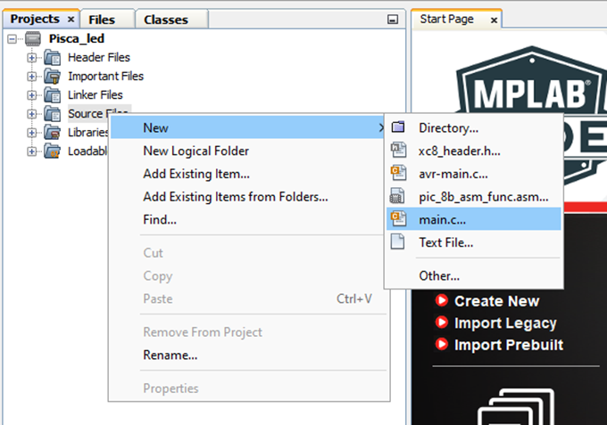

Após isso, você pode renomear o arquivo para `main` em `File Name:` e clique em `Finish`:

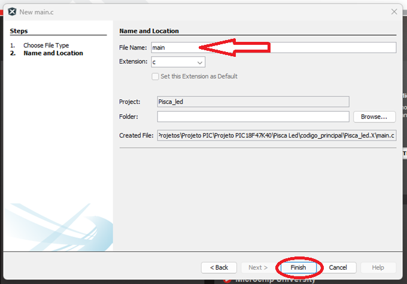

Seu projeto deve abrir corretamente:

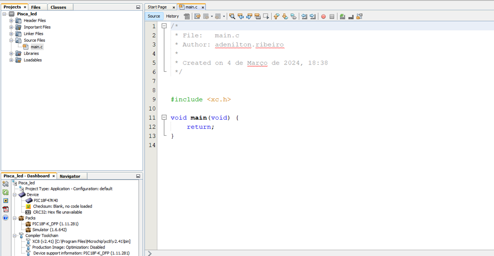

Após isso, vá até `Window`, selecione `Target Memory Views`, e depois `Configuration Bits`, em seguida, clique nele:

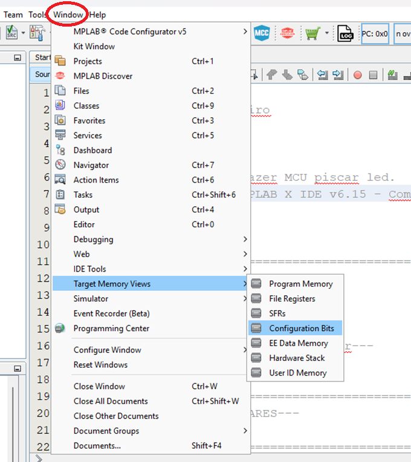

Então, a página de configuração dos Fuses será aberta em `Configuration Bits`:

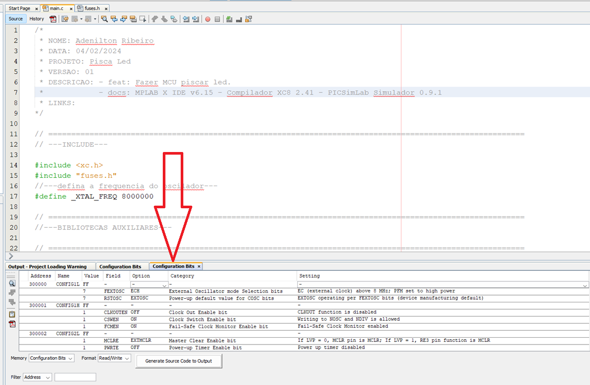

Você pode subir a página para visualizá-la melhor e também pode ajustar as configurações conforme sua preferência. Após isso, clique em `Generate Source Code to Output` para a saída:

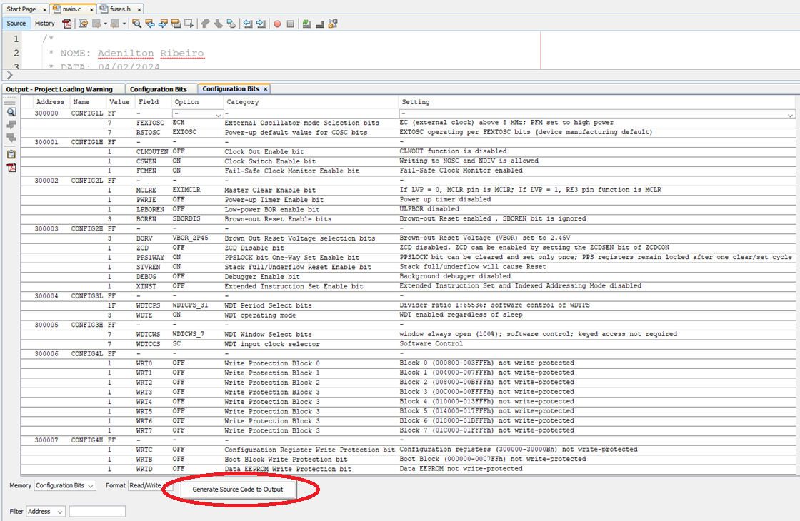

A saída para o código gerado será exibida em `Output`. Você pode copiar esse código pressionando `Ctrl + C`:

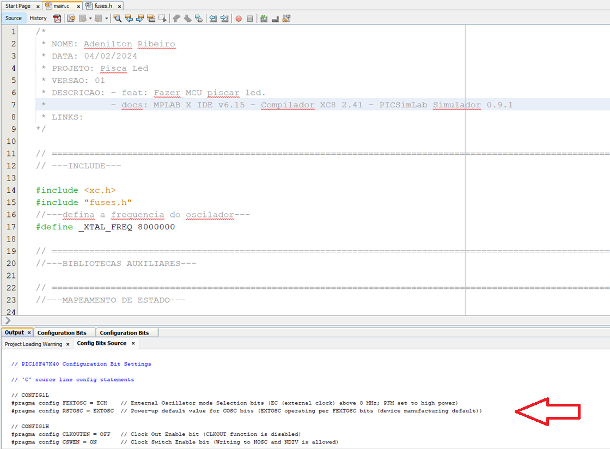

Após isso, vá até `Header files`, clique com o botão direito em `Header files`, navegue até `New` e selecione `xc8_header.h`:

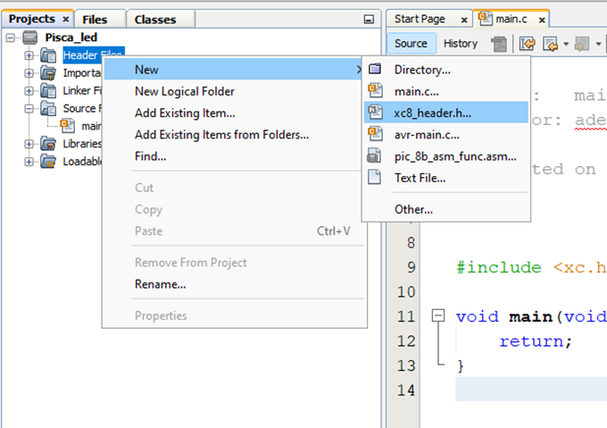

Após isso, você pode renomear o arquivo para `fuses` em `File Name:` e clique em `Finish`:

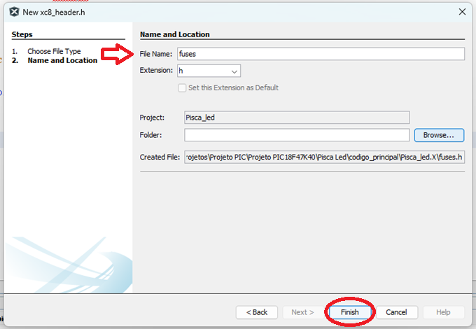

Após isso, você pode limpar o arquivo `fuses.h` que será criado e colar a saída gerada na página `Output`. Abaixo, estarei disponibilizando o código gerado e editado com cabeçalho:

```c
/*
 * NOME: Adenilton Ribeiro
 * DATA: 04/03/2024
 * PROJETO: Fuses.h
 * VERSAO: 01
 * DESCRICAO: - feat: Configurações de bits de configuração PIC18F47K40
 *            - docs: MPLAB X IDE v6.15 - Compilador XC8 2.41 - PICSimLab Simulador 0.9.1
 * LINKS: - 
*/

// ========================================================================================================
/**
 * @brief Fuses.h
 * 
 */ 
#ifndef FUSES_H
#define FUSES_H

// CONFIG1L
#pragma config FEXTOSC   = ECH       // Bits de seleção do modo oscilador externo (EC (relógio externo) acima de 8 MHz; PFM definido para alta potência)
#pragma config RSTOSC    = EXTOSC    // Valor padrão de inicialização para bits COSC (EXTOSC operando por bits FEXTOSC (padrão de fabricação do dispositivo))

// CONFIG1H
#pragma config CLKOUTEN  = OFF       // Bit de ativação do Clock Out (a função CLKOUT está desativada)
#pragma config CSWEN     = ON        // Bit de ativação da chave de relógio (é permitida a gravação em NOSC e NDIV)
#pragma config FCMEN     = ON        // Bit de ativação do monitor de relógio à prova de falhas (Monitor de relógio à prova de falhas ativado)

// CONFIG2L
#pragma config MCLRE     = EXTMCLR   // Bit Master Clear Enable (se LVP = 0, o pino MCLR é MCLR; se LVP = 1, a função do pino RE3 é MCLR)
#pragma config PWRTE     = OFF       // Bit de ativação do temporizador de inicialização (temporizador de inicialização desativado)
#pragma config LPBOREN   = OFF       // Bit de habilitação BOR de baixa potência (ULPBOR desabilitado)
#pragma config BOREN     = SBORDIS   // Bits de habilitação de reinicialização de brown-out (redefinição de brown-out habilitada, bit SBOREN é ignorado)

// CONFIG2H
#pragma config BORV      = VBOR_2P45 // Bits de seleção de tensão de reinicialização de brown out (Tensão de reinicialização de brown out (VBOR) definida como 2,45 V)
#pragma config ZCD       = OFF       // Bit de desativação de ZCD (ZCD desabilitado. ZCD pode ser habilitado configurando o bit ZCDSEN de ZCDCON)
#pragma config PPS1WAY   = ON        // PPSLOCK Bit PPSLOCK Bit de habilitação de configuração unidirecional (o bit PPSLOCK pode ser limpo e definido apenas uma vez; os registros PPS permanecem bloqueados após um ciclo de limpeza/definição)
#pragma config STVREN    = ON        // Bit de habilitação de redefinição de pilha cheia/subfluxo (pilha cheia/subfluxo causará reinicialização)
#pragma config DEBUG     = OFF       // Bit de habilitação do depurador (depurador em segundo plano desabilitado)
#pragma config XINST     = OFF       // Bit de habilitação do conjunto de instruções estendido (conjunto de instruções estendido e modo de endereçamento indexado desabilitados)

// CONFIG3L
#pragma config WDTCPS    = WDTCPS_31 // Bits de seleção de período WDT (proporção do divisor 1:65536; controle de software de WDTPS)
#pragma config WDTE      = OFF       // Modo de operação WDT (WDT ativado independentemente do sono)

// CONFIG3H
#pragma config WDTCWS    = WDTCWS_7  // Bits de seleção de janela WDT (janela sempre aberta (100%); controle de software; acesso com chave não é necessário)
#pragma config WDTCCS    = SC        // Seletor de clock de entrada DT (controle de software)

// CONFIG4L
#pragma config WRT0      = OFF       // Bloco de proteção contra gravação 0 (Bloco 0 (000800-003FFFh) não protegido contra gravação)
#pragma config WRT1      = OFF       // Bloco de proteção contra gravação 1 (Bloco 1 (004000-007FFFh) não protegido contra gravação)
#pragma config WRT2      = OFF       // Bloco de proteção contra gravação 2 (Bloco 2 (008000-00BFFFh) não protegido contra gravação)
#pragma config WRT3      = OFF       // Bloco de proteção contra gravação 3 (Bloco 3 (00C000-00FFFFh) não protegido contra gravação)
#pragma config WRT4      = OFF       // Bloco de proteção contra gravação 3 (Bloco 4 (010000-013FFFh) não protegido contra gravação)
#pragma config WRT5      = OFF       // Bloco de proteção contra gravação 3 (Bloco 5 (014000-017FFFh) não protegido contra gravação)
#pragma config WRT6      = OFF       // Bloco de proteção contra gravação 3 (Bloco 6 (018000-01BFFFh) não protegido contra gravação)
#pragma config WRT7      = OFF       // Bloco de proteção contra gravação 3 (Bloco 7 (01C000-01FFFFh) não protegido contra gravação)

// CONFIG4H
#pragma config WRTC      = OFF       // Bit de proteção contra gravação do registro de configuração (registros de configuração (300000-30000Bh) não protegidos contra gravação)
#pragma config WRTB      = OFF       // Bit de proteção contra gravação do bloco de inicialização (bloco de inicialização (000000-0007FFh) não protegido contra gravação)
#pragma config WRTD      = OFF       // Bit de proteção contra gravação da EEPROM de dados (EEPROM de dados não protegida contra gravação)
#pragma config SCANE     = ON        // Bit de habilitação do scanner (o módulo do scanner está disponível para uso, o bit SCANMD pode controlar o módulo)
#pragma config LVP       = ON        // Bit de habilitação de programação de baixa tensão (programação de baixa tensão habilitada. A função do pino MCLR/VPP é MCLR. O bit de configuração MCLRE é ignorado)

// CONFIG5L
#pragma config CP        = OFF       // Bit de proteção de código de memória do programa UserNVM (proteção de código UserNVM desativada)
#pragma config CPD       = OFF       // DataNVM Memory Code Protection bit (DataNVM code protection disabled)

// CONFIG5H

// CONFIG6L
#pragma config EBTR0     = OFF       // Bloco de proteção de leitura de tabela 0 (Bloco 0 (000800-003FFFh) não protegido de leituras de tabela executadas em outros blocos)
#pragma config EBTR1     = OFF       // Bloco de proteção de leitura de tabela 1 (Bloco 1 (004000-007FFFh) não protegido de leituras de tabela executadas em outros blocos)
#pragma config EBTR2     = OFF       // Bloco de proteção de leitura de tabela 2 (Bloco 2 (008000-00BFFFh) não protegido de leituras de tabela executadas em outros blocos)
#pragma config EBTR3     = OFF       // Bloco de proteção de leitura de tabela 3 (Bloco 3 (00C000-00FFFFh) não protegido de leituras de tabela executadas em outros blocos)
#pragma config EBTR4     = OFF       // Bloco de proteção de leitura de tabela 4 (Bloco 4 (010000-013FFFh) não protegido de leituras de tabela executadas em outros blocos)
#pragma config EBTR5     = OFF       // Bloco de proteção de leitura de tabela 5 (Bloco 5 (014000-017FFFh) não protegido de leituras de tabela executadas em outros blocos)
#pragma config EBTR6     = OFF       // Bloco de proteção de leitura de tabela 6 (Bloco 6 (018000-01BFFFh) não protegido de leituras de tabela executadas em outros blocos)
#pragma config EBTR7     = OFF       // Bloco de proteção de leitura de tabela 7 (Bloco 7 (01C000-01FFFFh) não protegido de leituras de tabela executadas em outros blocos)

// CONFIG6H
#pragma config EBTRB     = OFF       // Bit de proteção de leitura de tabela do bloco de inicialização (bloco de inicialização (000000-0007FFh) não protegido de leituras de tabela executadas em outros blocos)

#endif

// #pragma as instruções de configuração devem preceder as inclusões do arquivo do projeto.
// Use enums de projeto em vez de #define para ON e OFF.
// ========================================================================================================
```

No arquivo `fuses.h`, você deve adicionar dois campos de configuração, conforme mostrado na imagem abaixo, nas linhas 16 e 17:

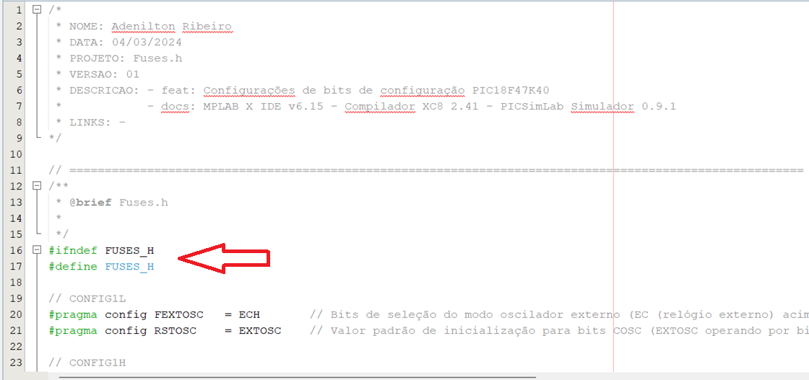

As diretivas `#ifndef` e `#endif` devem ser adicionadas para garantir a inclusão condicional do código:

```c
#ifndef FUSES_H
#define FUSES_H
```

No mesmo arquivo, você deve encerrar as configurações com `#endif` na linha 86, conforme mostrado na imagem abaixo:

```c
#endif
```

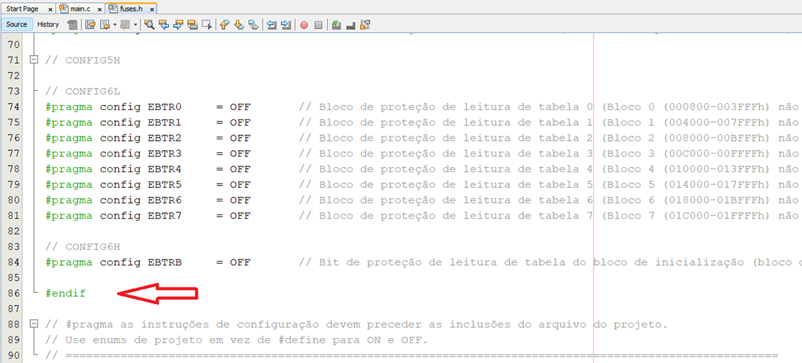

Com essas linhas adicionadas, salve o arquivo `fuses.h` e vá para o arquivo `main.c`. Adicione `#include fuses.h` ao seu projeto, conforme mostrado na imagem abaixo, na linha 16:

```c
#include "fuses.h"
```

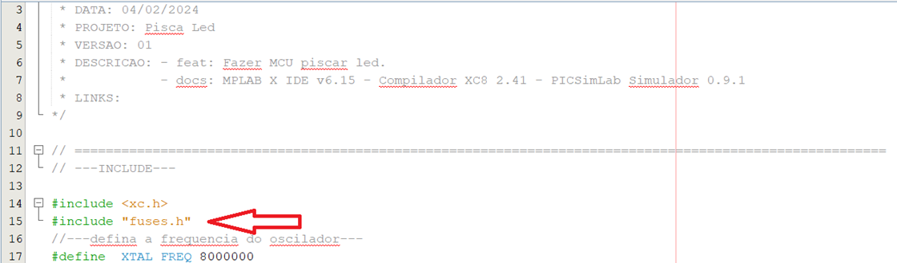

Para finalizar a configuração do projeto, no arquivo `fuses.h`, na linha 44, altere `#pragma config WDTE = ON` para `#pragma config WDTE = OFF` e salve o arquivo:

Depois de concluir toda a programação, basta posicionar o cursor sobre o ícone do projeto `1-Pisca-led`, clicar com o botão direito do mouse e selecionar `Build`:

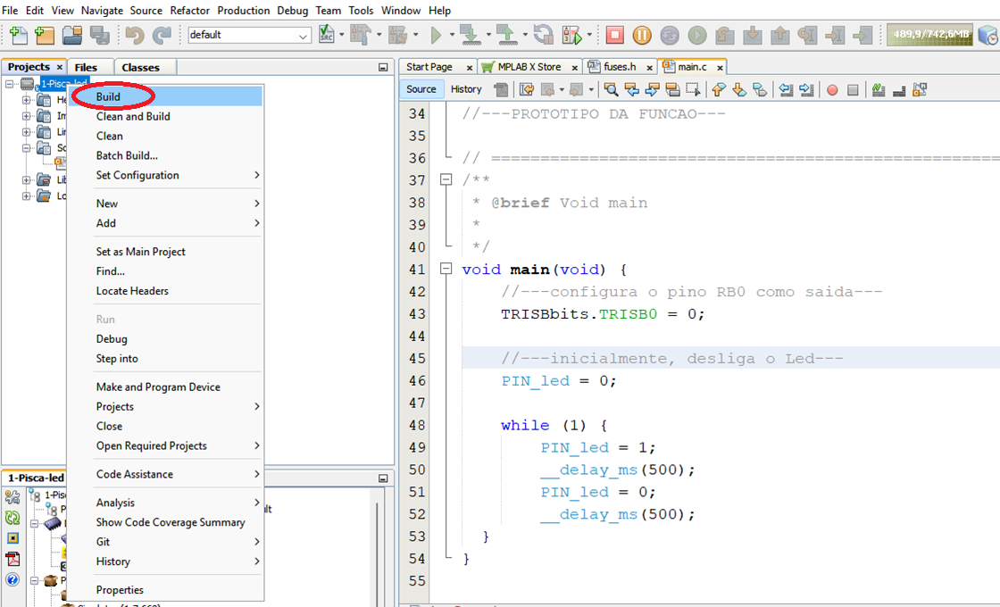

Se o código foi digitado corretamente, você verá uma mensagem de sucesso:

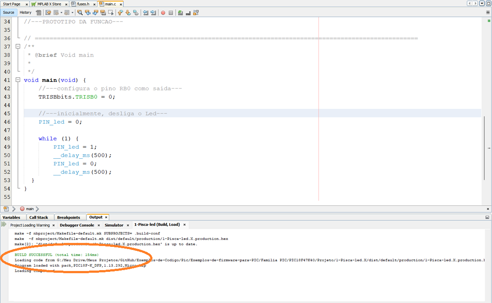

Seu ambiente e microcontrolador estão configurados e prontos para começar a trabalhar nos [projetos](https://github.com/AdeniltonR/Exemplos-de-firmware-para-PIC/tree/main/Familia%20PIC/PIC18F47K40).