# _Configuração de Ambiente_

---

## Sumário

- [Histórico de Versão](#histórico-de-versão)
- [Resumo](#resumo)
- [Requisitos](#requisitos)
- [Informações Adicionais](#informações-adicionais)
    - [Instalação MPLAB X IDE](#instalação-mplab-x-ide)
    - [Instalação Compilador XC8](#instalação-compilador-xc8)
    - [Instalação PICSimLab](#instalação-picsimlab)
- [Informações](#informações)

## Histórico de Versão

| Versão | Data       | Autor       | Descrição         |
|--------|------------|-------------|-------------------|
| 1.0.0  | 05/03/2024 | Adenilton R | Início do Projeto |

## Resumo

Este documento visa fornecer orientações para a instalação dos softwares necessários, incluindo o MPLAB X IDE v6.20, o Compilador XC8 2.46 e o Simulador PICSimLab 0.9.1, bem como para a configuração do microcontrolador na IDE MPLAB X. Cada exemplo de projeto será detalhadamente abordado, fornecendo instruções passo a passo para execução nos respectivos softwares mencionados.

## Requisitos

Softwares a serem instalados:

📥 [`MPLAB X IDE`](https://www.microchip.com/en-us/tools-resources/develop/mplab-x-ide#tabs)

📥 [`Compilador XC8`](https://www.microchip.com/en-us/tools-resources/develop/mplab-xc-compilers/xc8)

📥 [`PICSimLab`](https://sourceforge.net/projects/picsim/)

Configuração do microcontrolador:

⚙️ [`PIC18F47K40`](https://github.com/AdeniltonR/Exemplos-de-firmware-para-PIC/tree/main/Familia%20PIC/PIC18F47K40)

## Informações Adicionais

Este documento apresentará os passos detalhados para a instalação e configuração do ambiente, incluindo os softwares necessários.

### Instalação MPLAB X IDE

Para baixar software 📥 [`MPLAB X IDE`](https://www.microchip.com/en-us/tools-resources/develop/mplab-x-ide#tabs):

Depois de baixar o software, basta clicar nele para abri-lo e seguir as instruções clicando em `Next>` conforme necessário:

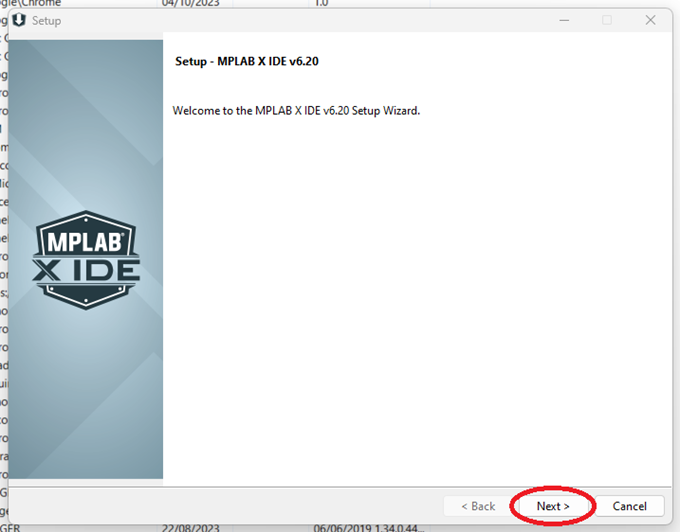

Na próxima página, clique em `| accept the agreement` para aceitar os termos e, em seguida, clique em `Next>`:

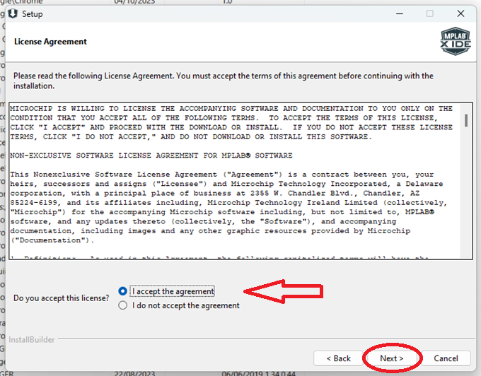

Na próxima página, selecione o diretório para salvar os arquivos e clique em `Next>`. Em seguida, o software será instalado e você só precisará aguardar:

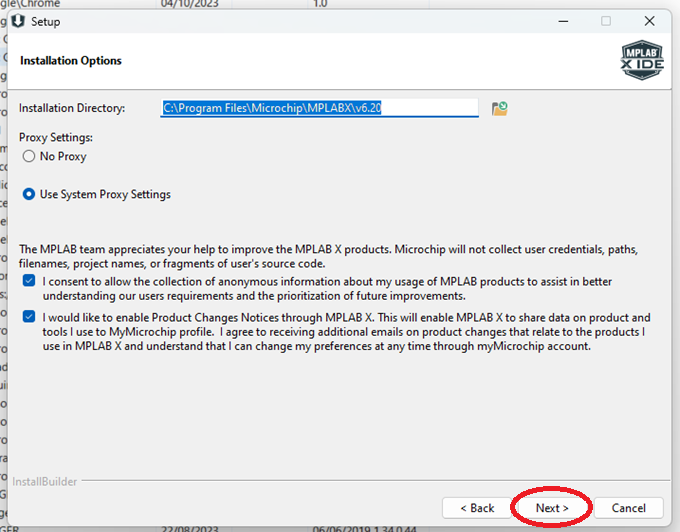

Depois de instalar o `MPLAB X IDE`, na versão `v2.20`, as opções de compilador já estarão disponíveis. Para o nosso projeto, vamos usar o compilador `XC8 8-bit MCUs (2.58GB)`, mas você pode instalar outros se desejar. Selecione a opção desejada, que deve ser a `XC8 8-bit MCUs (2.58GB)`, e clique em `Next>`:

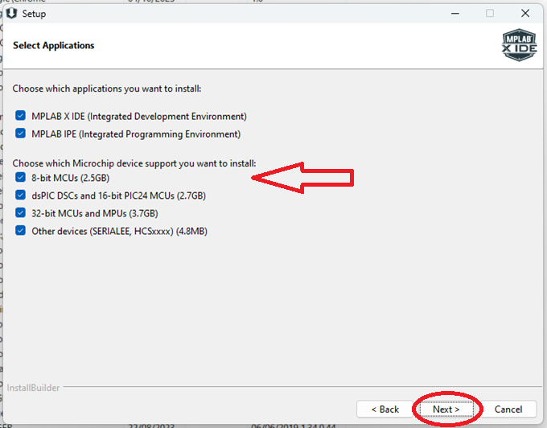

Na próxima página, clique em `Next>`:

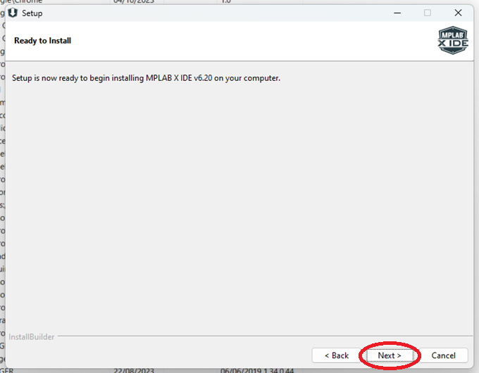

Nessa página, confirme o compilador que você escolheu e clique em `Finish`. No meu caso, pedi para instalar todos, mas o necessário é apenas o `XC8 compiler v2.46 (8-bit devices)`:

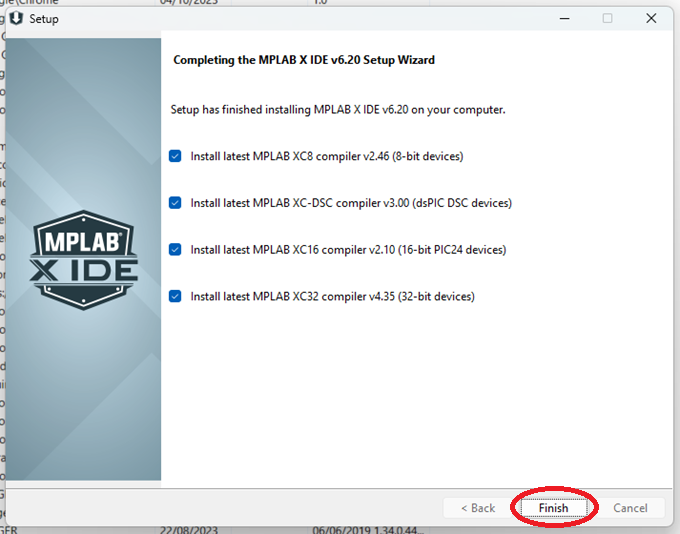

### Instalação Compilador XC8

Para baixar software 📥 [`Compilador XC8`](https://www.microchip.com/en-us/tools-resources/develop/mplab-xc-compilers/xc8):

Quando você clicar em `Finish`, conforme mostrado na imagem acima, o software do XC8 será aberto para iniciar a instalação. Clique em `Next>`:

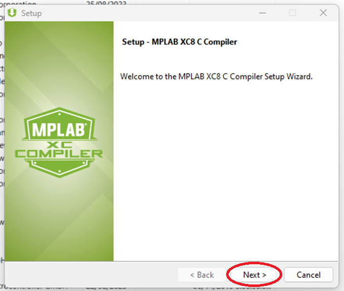

Na próxima página, selecione a opcão `Free` e clique em `Next>`:

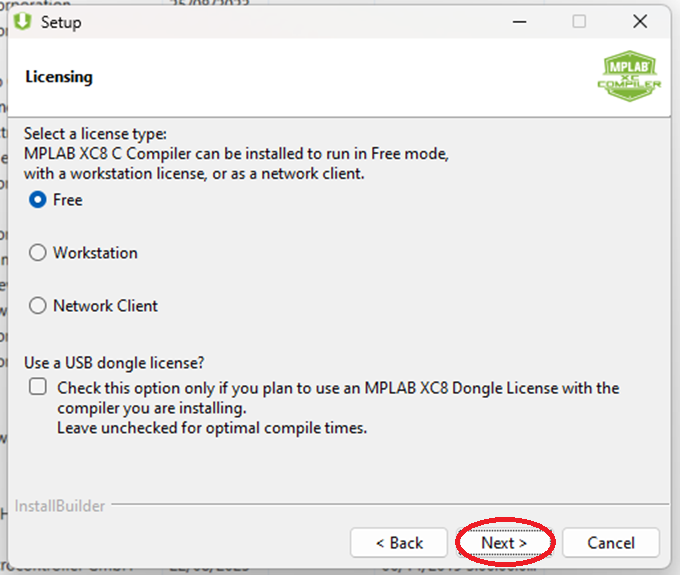

Na próxima página, selecione o diretório para salvar os arquivos e clique em `Next>`:

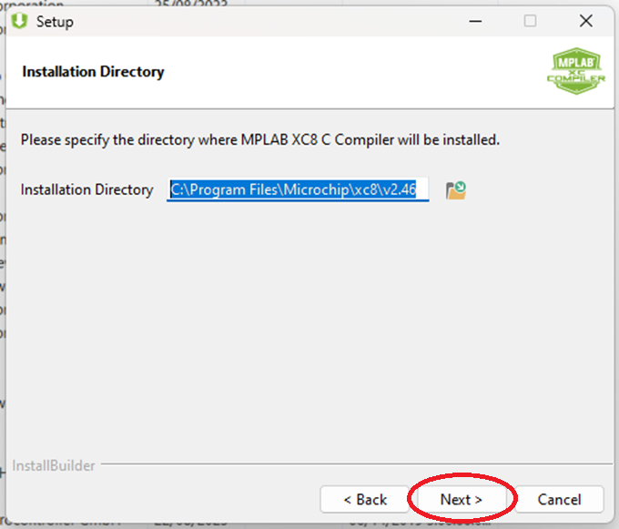

Na próxima página, selecione ambas as opções e clique em `Next>`:

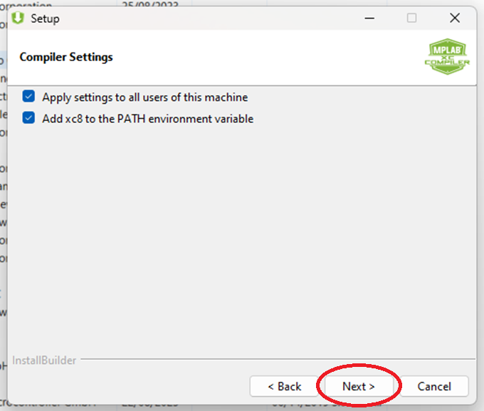

Se estiver tudo conforme desejado, basta clicar em `Next>` e aguardar a instalação:

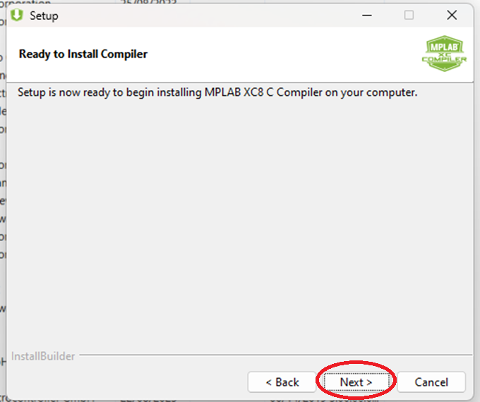

Na próxima página, clique em `Next>`:

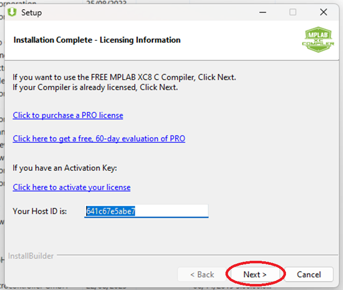

Na próxima página, clique em `Finish`. Se você selecionou mais de um compilador, basta seguir o mesmo procedimento para os outros compiladores:

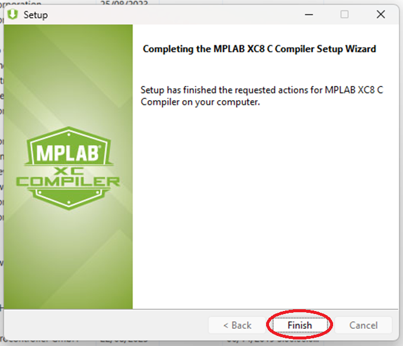

### Instalação PICSimLab

Para baixar software 📥 [`PICSimLab`](https://sourceforge.net/projects/picsim/):

Depois de baixar o software, simplesmente selecione o idioma de sua preferência e clique em `OK`:

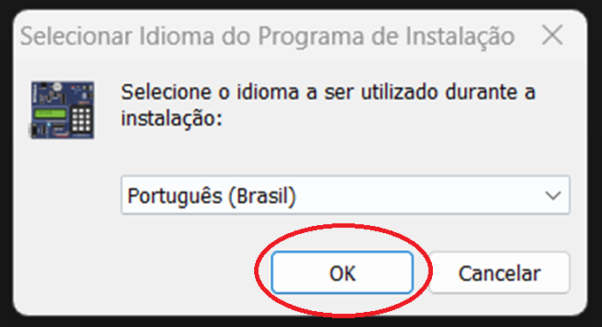

Na próxima página, clique em `Eu aceito os termos do Contrato`, em seguida, clique em `Avançar>`:

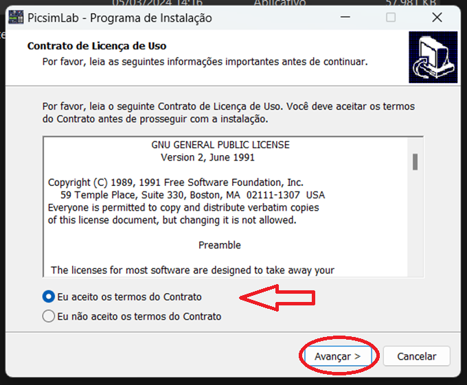

Na próxima página, selecione o diretório para salvar os arquivos e clique em `Avançar>`:

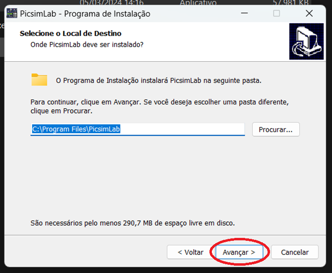

Na próxima página, selecione a opcão de sua preferencia e clique em `Avançar>`:

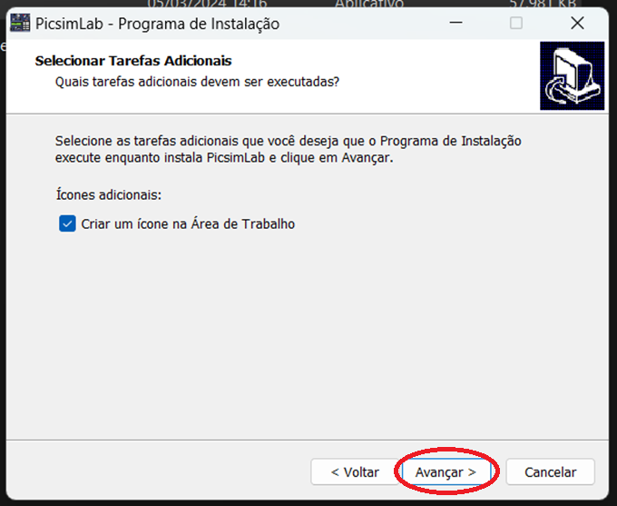

Na próxima página, clique em `Instalar`:

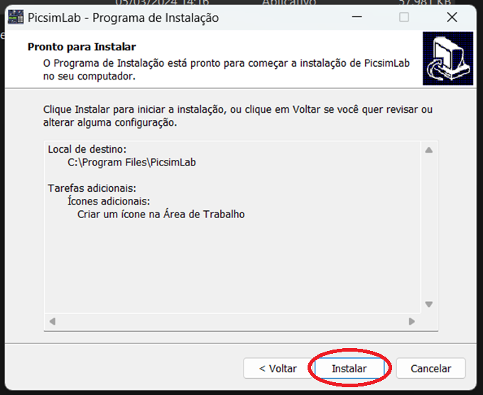

Na próxima página, aguarde a instalação do software:

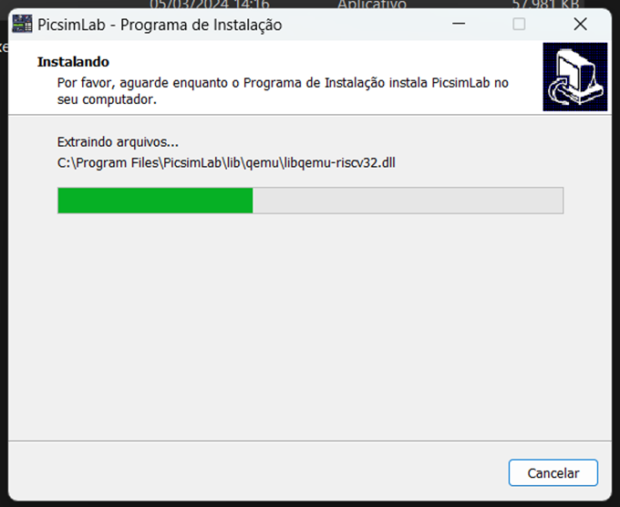

Na próxima página, clique em `Concluir`:

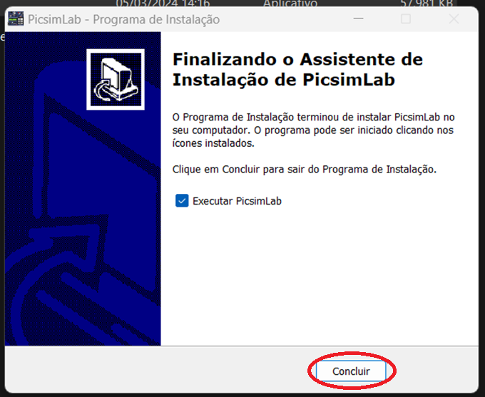

E seu ambiente estará totalmente instalado. Para configurá-lo para o microcontrolador, basta acessar a página de [configuração MCU](https://github.com/AdeniltonR/Exemplos-de-firmware-para-PIC/tree/main/Familia%20PIC/PIC18F47K40):

## Informações

| Software     | Versão |
|--------------|--------|
| MPLAB X IDE  | v6.20  |
| Compiler XC8 | v2.46  |
| PICSimLab    | v0.9.1 |